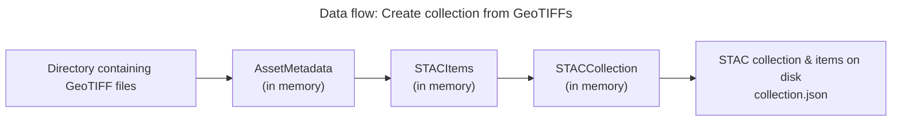
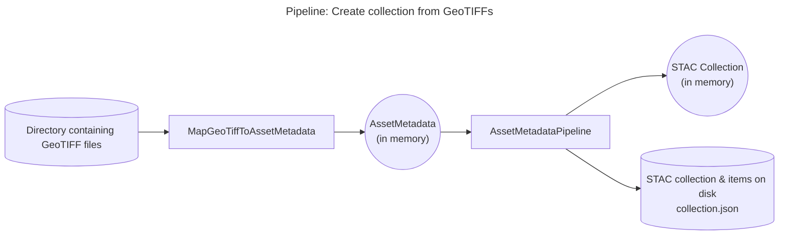
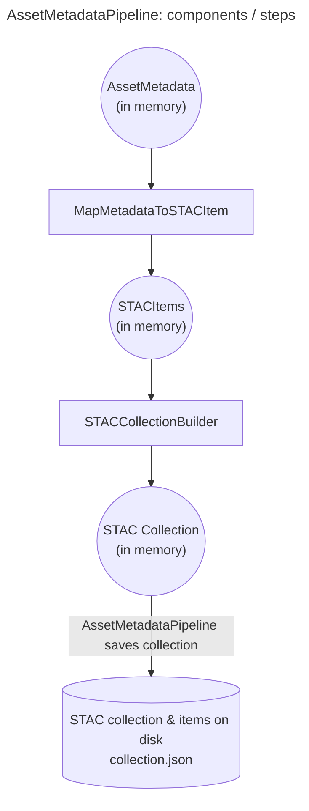
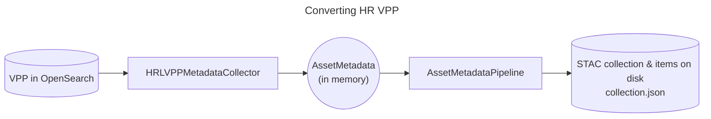
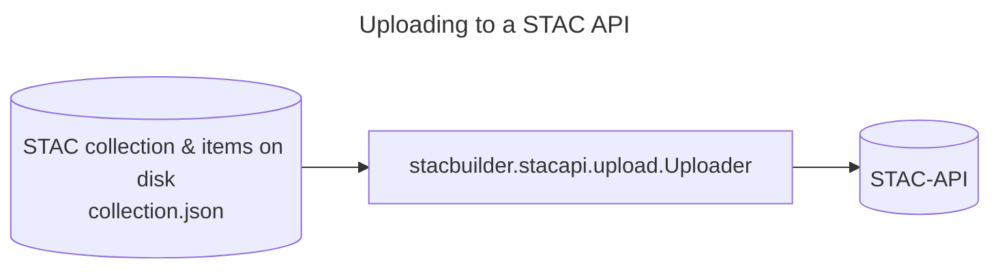

# Workflow for Creating STAC Collections

## Create a collection from a directory containing GeoTIFFs

### Overview: Steps to Take

### Data flow

What data is produced from what, from source to end result:

### Pipeline components

Which components convert which input data to what output?

The AssetMetadataPipeline is a shared part of all pipelines that should be the same, no matter what the source data is, or what the destination is.

We basically plug in a component at the input side and at the output side of AssetMetadataPipeline.
That input expects a list (or any iterable) of AssetMetadata objects, that represent the file or product, AKA the asset.

At its output the AssetMetadata produces a pystac Collection, and it saves that to file, including all its STAC items, and optionally all its sub-collections, if you chose to create a group of collections.

A closer look at what happens inside the AssetMetadataPipeline.
Internally the AssetMetadataPipeline uses smaller pipeline steps to do parts of the work.
This keep the classes smaller and simpler, so they are easier to understand, and also easier to write tests for.

## Grouped collections

In some cases the collection has very many STAC items and it becomes unwieldly to put all the items in one collection.json file. There are too many links to all the items in the collection file, which slows things down.

So what we do for these large collections is to create several collections, one for each year, and group them into a root collection. That way each subcollection has less links to the STAC items to manage.

Now a STAC collection is also a STAC catalog (i.e. it is a subclass). A collection just has some extra information that a catalog does not contain. So what happens here is that the root collection functions as a catalog. But it is useful to make it a collection anyway because that lets us have the extra information at the top level, for example spatial and temporal extent. Also, it keeps the top level more uniform.

## Converting HR VPP (OpenSearch / OSCARS) Collections to STAC Collections

This solves a specific need we had at VITO.

We have some collections for HR VPP in OpenSearch that can be accessed via the terracatalogueclient.
We wanted to have those as STAC collections with a structure that is more suitable to STAC.

This is what the VPP commands in the CLI and the commandapi.py module are for.

Essentially we replace the input side that plugs into the `AssetMetadataPipeline` with a different  implementation of `IMetadataCollector`, namely the `HRLVPPMetadataCollector`.

## Uploading Collections to a STAC API

Saving a STAC collection to a file is called a static STAC collection, but there is also a dynamic version of STAC collections, called a [STAC API](https://github.com/radiantearth/stac-api-spec).

With the stac-catalog-builder we can also upload a collection to a STAC API.

For the time being we have chosen not to upload directly to a STAC API while the tool is generating (or converting) a STAC collection.
The reason being, for thge cases we want to solve we have quite large collections, so the process to generate a STAC collection can take a while.

Therefor, for the time being, it is easier to let the generation process run to completion, saving the entire set of files on disk, and then run the upload as a second step.

Because the large amount of STAC items would make the collection.json file large, slowing down the tool, we don't include links to the STAC items in the STAC collection for these collections.
Since a STAC API uses other means to keep track which items belong to the collection, we don't actually need those links for collections we publish via a STAC API. Only the STAC items need to have a link to the collection they belong to.

