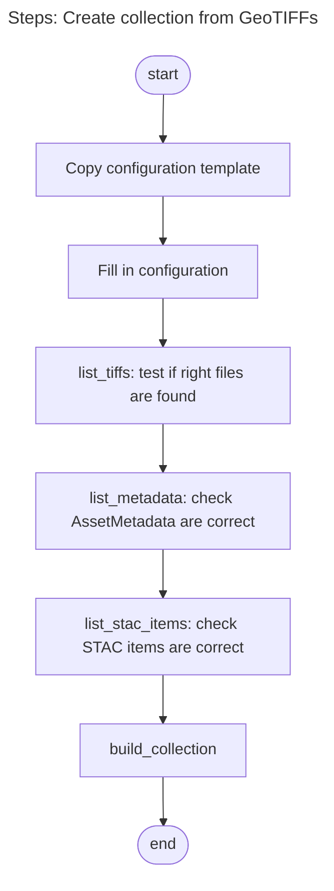
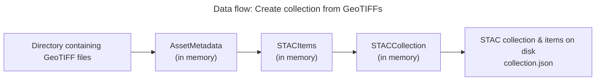
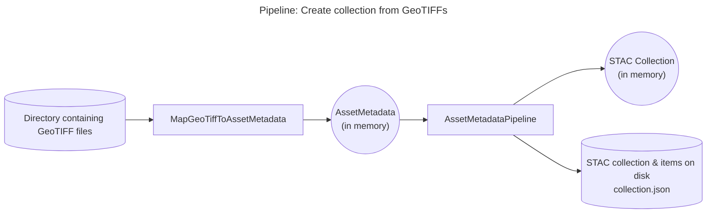
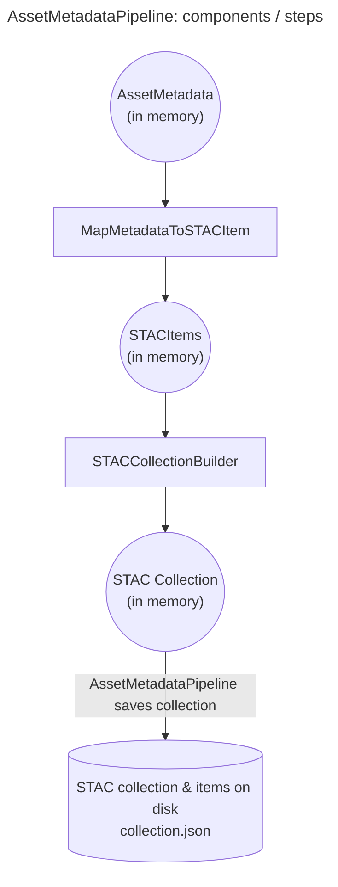

# Workflow for Creating STAC Collections

## Create a collection from a directory containing GeoTIFFs

### Overview: Steps to Take

### Data flow

What data is produced from what, from source to end result:

### Pipeline components

Which components convert which input data to what output?

The AssetMetadataPipeline is a shared part of all pipelines that should be the same, no matter what the source data is, or what the destination is.

We basically plug in a component at the input side and at the output side of AssetMetadataPipeline.
That input expects a list (or any iterable) of AssetMetadata objects, that represent the file or product, AKA the asset.

At its output the AssetMetadata produces a pystac Collection, and it saves that to file, including all its STAC items, and optionally all its sub-collections, if you chose to create a group of collections.

A closer look at what happens inside the AssetMetadataPipeline.
Internally the AssetMetadataPipeline uses smaller pipeline steps to do parts of the work.
This keep the classes smaller and simpler, so they are easier to understand, and also easier to write tests for.

## Grouped collections

TODO: describe what a grouped collection is. Maybe we need a better name.

How to translate this to a diagram that shows what is different?
